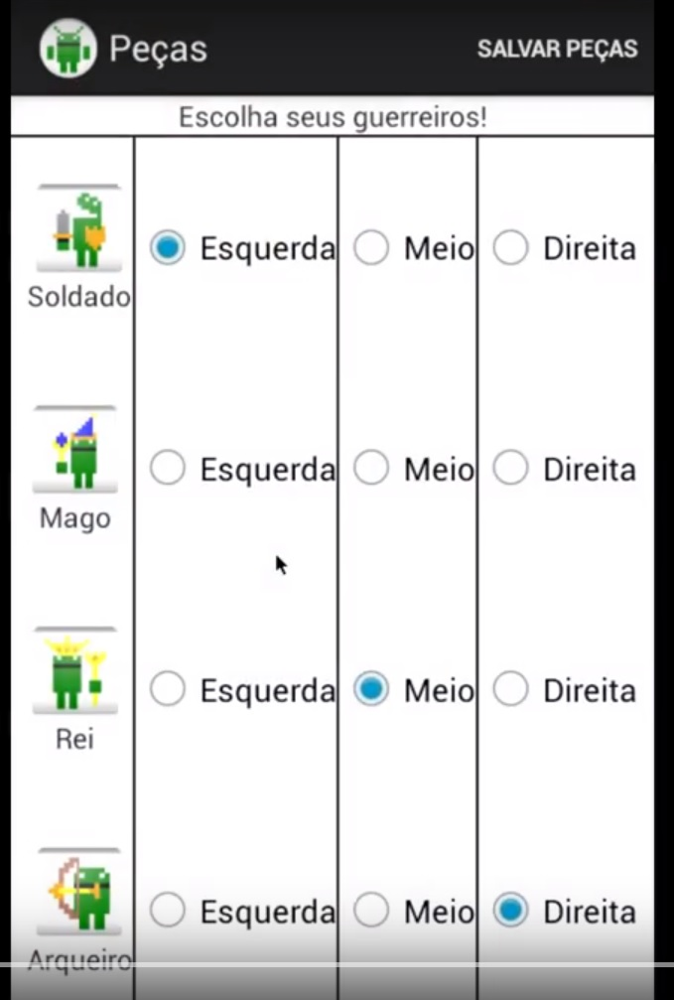
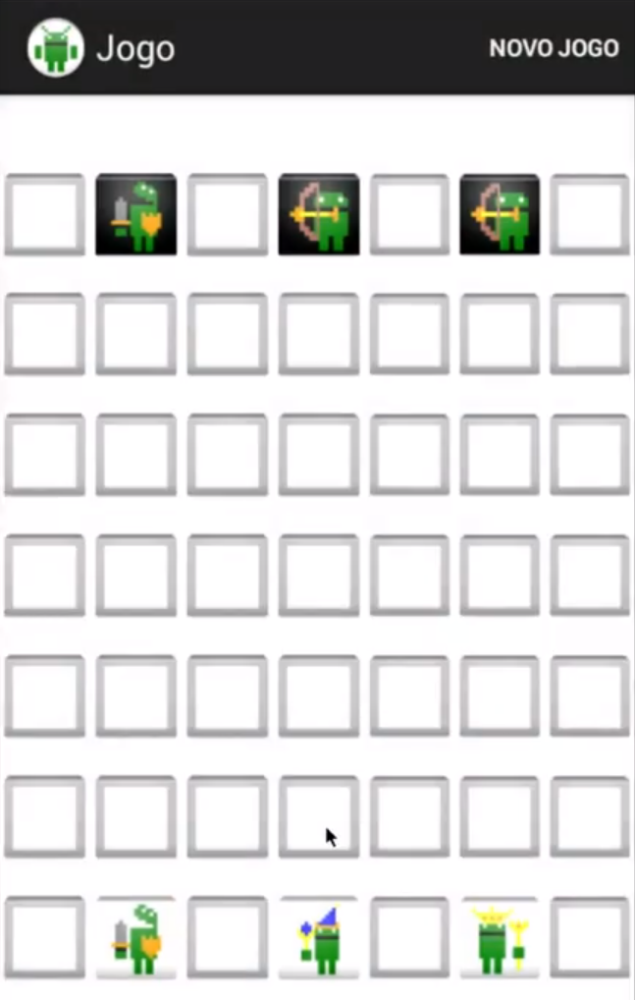

**Youtube**: https://www.youtube.com/watch?v=nRaM2R9Z8ig

# PUC-INF1804
Topicos em Eng Computação IV (Android)
Matéria para aprender a usar Android, como trabalho eu escolhi fazer um jogo parecido com xadrez e chamei ele de niuxes.  

# About
Niuxes se resumia a um jogo de xadrez onde cada jogador teria apenas 3 peças em campo e poderia escolher quais vão ser.  

  

Nessa imagem você consegue ver que você pode botar cada peça em 3 posições (esquerda, meio e direita) e repetir ela se quiser.  
Cada peça tinha modos de andar únicos.  

  
  
